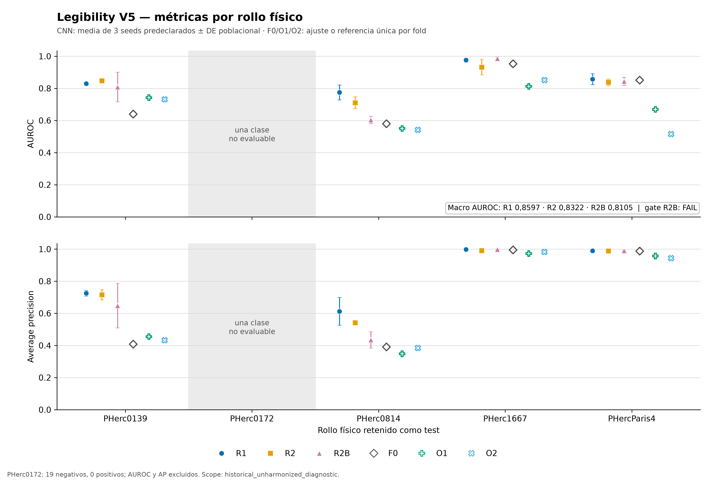

# Legibility index v5 — a corrected-label retraining that improves on the archived model

We retrained the small legibility classifier behind the
[legibility index](https://github.com/LimeGS/herculaneum-legibility-index) on a
corrected historical cohort. **V5 improves sharply on the archived `proxy_v4`:
macro AUROC 0.810 vs 0.756 across four scrolls, leave-one-scroll-out over three
seeds (+0.054).** The shipped checkpoint is **R2B**, the candidate frozen before
the test was consulted.

## What this is

A ResNet-18 that ranks ~1 cm windows of Vesuvius Challenge **ink-probability
maps** by legible-text likelihood (connected Greek letterforms vs. fiber
texture / noise / damage). It is a triage tool that runs *downstream* of the
official ink detectors. It does not detect ink, read letters or transcribe
anything.

The metric is **macro AUROC** over the four evaluable scrolls (equal weight),
averaged over three seeds. It measures ranking, not accuracy, and is not a
calibrated probability.

## The result

| Arm | What it is | Macro AUROC | Seed SD |
|---|---|---:|---:|
| **F0** | archived `proxy_v4` (reference) | 0.7558 | fixed |
| O1 / O2 | four pixel statistics (controls) | 0.693 / 0.660 | one fit per fold |
| R1 | corrected historical originals | 0.8597 | 0.0166 |
| R2 | R1 + admitted additions | 0.8322 | 0.0068 |
| **R2B** | **shipped**: R2 + per-scroll/class loss balancing | **0.8105** | 0.0220 |

- **V5 (R2B) − v4 = +0.0547** macro; on the same folds the archived model
  scored 0.756. Correcting the labels is what moves the needle: the pixel
  controls stay at 0.66–0.69, well below v4.
- The shipped checkpoint is **R2B**, the arm predeclared as the V5 candidate:
  its recipe, step budget and status were frozen before the test was consulted.
  R1 (a cross-validation arm) scored higher and is retained as a hypothesis to
  confirm in new territory with criteria fixed in advance; it is not exported.

Per-scroll means over three seeds; error bars are one population SD. PHerc0172
(shaded, excluded) has only negatives, so AUROC is undefined there. `F0` is a
historical reference with known exposure (PHercParis4 was in its training);
the deltas vs. F0 are retrospective and do not prove superiority on a new
external sample.

## The shipped artifact

The exported checkpoint is the all-data R2B refit (seed 0, 356 steps, median of
the 15 validation-selected step fractions). It has **no held-out evaluation**
of its own. Its checkpoint is `7179f40882a7…` (SHA-256
`7179f40882a755d885d9eca88eb0a9b54c436264cd3bcd8c913054812294865c`), and its
machine-readable status is `EXPERIMENTAL` — the honest label for an artifact
whose comparison is a retrospective historical diagnostic, not a confirmatory
trial.

## Artifacts (published)

| What | Where |
|---|---|
| Model card + checkpoint (v5 / R2B) | https://huggingface.co/LimeGS/herculaneum-legibility-proxy-v5 |
| Cohort (2,836 cases), splits, source bundles, raw crops, full code | https://huggingface.co/datasets/LimeGS/herculaneum-legibility-proxy-labels-v5 |
| Archived v4 model + index | https://github.com/LimeGS/herculaneum-legibility-index |

Everything is reproducible from public data: the dataset repo ships the source
bundles and raw crops plus `prepare_data.py` / `train.py` /
`evaluate_training.py` / `export_model.py`, the frozen `training_config.json`
and `refit_config.json`, and the full evidence (`REPORT.md`,
`results_independent_review.md`, `freeze.v2.json`, `comparisons.json`).

## What it is NOT / limits

- **Not independently validated.** Scope is `historical_unharmonized_diagnostic`.
  Missing: physically transported masks, certified crop/raster/geometry
  correspondence, fine territorial groups, and a new confirmatory test.
- **No territorial confidence interval:** every `physical_group` is unknown.
- Three seeds describe initialization/order sensitivity, not territorial
  replication.
- Scores are **uncalibrated**, do not enable an automatic rejection threshold,
  and do not transfer across ink-render families.
- The portable scorer runs CPU FP32; the historical metrics used CUDA BF16, so
  small numerical differences are possible.
- The 430 additions are provisional training-only labels, not a newly certified
  sample. The 430-addition and balancing arms (R2, R2B) scored below R1 in this
  comparison, which is why the exported artifact is labelled experimental.

## License

Text and figures CC BY 4.0. Model/dataset artifacts CC BY-NC 4.0, matching the
Vesuvius Challenge data they derive from. Repo v4
(`herculaneum-legibility-index`) is untouched.
